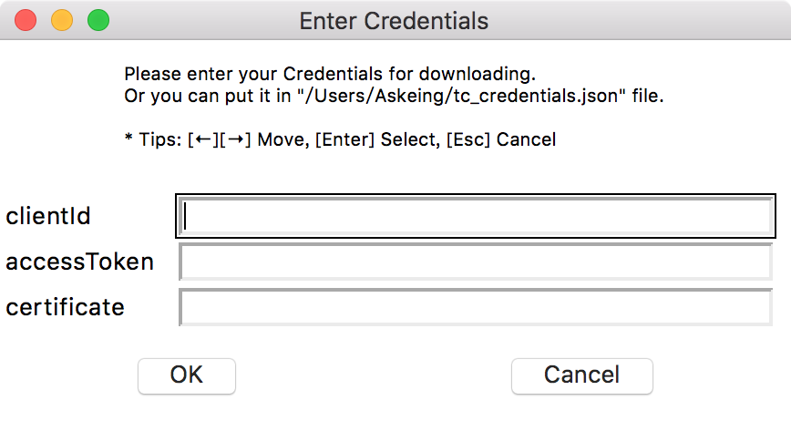
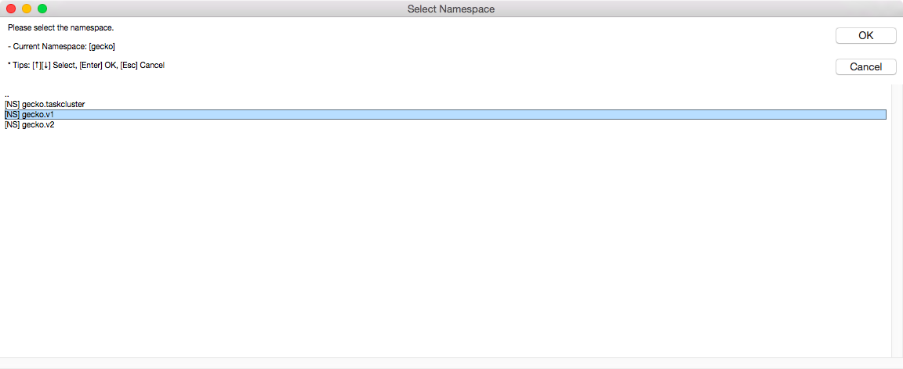
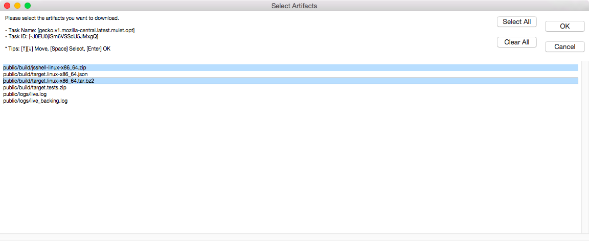

taskcluster-util-python
=======================
.. image:: https://travis-ci.org/askeing/taskcluster-util-python.svg
    :target: https://travis-ci.org/askeing/taskcluster-util-python

Python Taskcluster Utilities.

Installation
------------

To install **taskcluster_util**, simply:

.. code-block:: bash

    $ pip install -U taskcluster_util

Tools Usages
------------

taskcluster_download
++++++++++++++++++++

Download artifacts from command line.

.. code-block:: bash

    usage: taskcluster_download [-h] [--credentials CREDENTIALS]
                                (-n NAMESPACE | -t TASK_ID) [-a ARITFACT_NAME]
                                [-d DEST_DIR] [-v]

    The simple download tool for Taskcluster.

    optional arguments:
      -h, --help            show this help message and exit
      --credentials CREDENTIALS
                            The credential JSON file (default: tc_credentials.json)
      -n NAMESPACE, --namespace NAMESPACE
                            The namespace of task
      -t TASK_ID, --taskid TASK_ID
                            The taskId of task
      -v, --verbose         Turn on verbose output, with all the debug logger.

    Download Artifact:
      The artifact name and dest folder

      -a ARITFACT_NAME, --artifact ARITFACT_NAME
                            The artifact name on Taskcluster
      -d DEST_DIR, --dest-dir DEST_DIR
                            The dest folder (default: current working folder)

    The tc_credentials.json Template:
        {
            "clientId": "",
            "accessToken": ""
        }

taskcluster_traverse
++++++++++++++++++++

Travese namespace and download artifacts from GUI.

.. code-block:: bash

    usage: taskcluster_traverse [-h] [--credentials CREDENTIALS] [-n NAMESPACE]
                                [-d DEST_DIR] [-v]

    The simple GUI traverse and download tool for Taskcluster.

    optional arguments:
      -h, --help            show this help message and exit
      --credentials CREDENTIALS
                            The credential JSON file (default: tc_credentials.json)
      -n NAMESPACE, --namespace NAMESPACE
                            The namespace of task
      -d DEST_DIR, --dest-dir DEST_DIR
                            The dest folder (default: current working folder)
      -v, --verbose         Turn on verbose output, with all the debug logger.

    The tc_credentials.json Template:
        {
            "clientId": "",
            "accessToken": ""
        }

Screenshot
~~~~~~~~~~

* Input Credentials

* Traverse Namespaces

* Download Artifacts

SSL InsecurePlatformWarning
---------------------------

If you got the following error message when running the tools, please install **requests[security]** package.

.. code-block:: bash

    InsecurePlatformWarning: A true SSLContext object is not available.
    This prevents urllib3 from configuring SSL appropriately and may cause certain SSL connections to fail.
    For more information, see https://urllib3.readthedocs.org/en/latest/security.html#insecureplatformwarning.

Install package by pip install. Please note it's not required for Python 2.7.9+.

.. code-block:: bash

    pip install requests[security]

If you got **Setup script exited with error: command 'gcc' failed with exit status 1** error when install **requests[security]**, please install **libffi-dev**. (Ubuntu)

.. code-block:: bash

    sudo apt-get install libffi-dev

